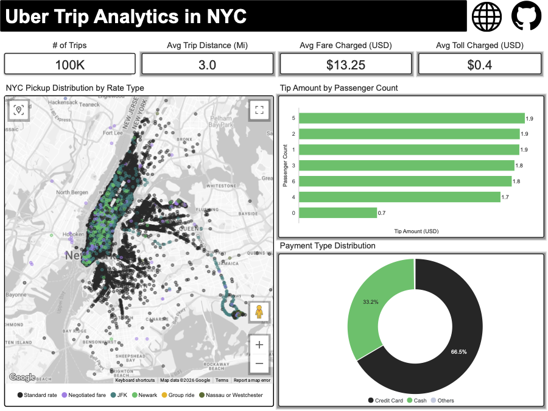
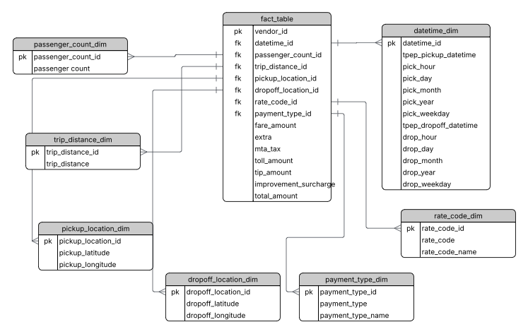
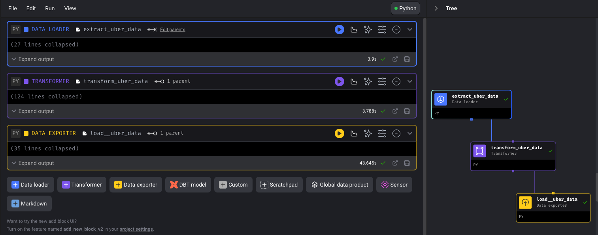
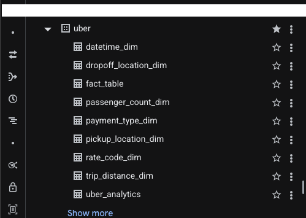

# 🚕 Uber Trip Analytics - Data Engineering Project

## Project Overview

This end-to-end data engineering project analyzes 100,000+ NYC Uber trips to uncover insights on pickup hotspots, fare patterns, payment trends, and passenger behavior. A sample population was extracted from the NYC TLC Trip Record Data, converted from Parquet to CSV, and stored in Google Cloud Storage. Data was transformed into a star schema data warehouse using Mage AI, loaded into both **BigQuery** and **Snowflake**, and visualized in an interactive Looker Studio dashboard.

## 🔗 Live Dashboard

[View Live Dashboard](https://lookerstudio.google.com/reporting/9fb56b9d-87f2-4fa7-a47e-5999c5619920)



## 📊 Key Insights

- **100K+** Uber trips analyzed
- **66.5%** of payments made by Credit Card
- **$13.25** average fare per trip
- **3.0 miles** average trip distance
- **Manhattan** is the busiest pickup location
- **$0.40** average toll charged per trip

## 🏗️ Architecture

The pipeline follows these steps:

1. NYC TLC trip data sampled, converted from Parquet to CSV, and stored in **Google Cloud Storage**
2. **Mage AI** orchestrates the ETL pipeline
3. Data transformed into a **star schema** with fact and dimension tables
4. Loaded into **BigQuery** and **Snowflake** in parallel
5. Visualized in **Looker Studio**

## ❄️ Snowflake Integration

As an extension to the original project, all transformed tables were loaded into **Snowflake** in parallel alongside BigQuery, simulating a real-world multi-warehouse pipeline.

**Snowflake setup:**
- Virtual warehouse: `UBER_WH` (X-Small, auto-suspend 60s)
- Database: `UBER_DB`
- Schema: `ANALYTICS`
- All 8 fact and dimension tables loaded via `snowflake-connector-python`

**Security:**
- Credentials stored as environment variables and loaded via `io_config.yaml`
- `io_config.yaml` excluded from version control via `.gitignore`

🔗 [View Snowflake Table Scripts](Snowflake/Create_Table_Scripts.sql)
🔗 [View Snowflake Analytics Queries](Snowflake/Queries.sql)

## 📐 Data Model



## 🔄 Mage AI Pipeline



🔗 [View Mage AI Pipeline Code](mage/)

## 🗄️ BigQuery Data Warehouse



🔗 [View SQL Script](BigQuery/uber_analytics.sql)

## 🛠️ Tech Stack

| Tool | Purpose | Link |
|------|---------|------|
| Python | Data transformation and pipeline logic | [Code](mage/) |
| Mage AI | ETL pipeline orchestration | [mage.ai](https://www.mage.ai) |
| Google Cloud Storage | Raw data lake | [GCS](https://cloud.google.com/storage) |
| BigQuery | Primary data warehouse | [BigQuery](https://cloud.google.com/bigquery) |
| Snowflake | Secondary data warehouse | [Snowflake](https://www.snowflake.com) |
| Looker Studio | Data visualization | [Dashboard](https://lookerstudio.google.com/reporting/9fb56b9d-87f2-4fa7-a47e-5999c5619920) |

## 📁 Project Structure

```
Uber_Trip_Analytics/
├── README.md
├── images/
│   ├── Uber_ERD_Diagram.png
│   ├── BigQueryTables.png
│   ├── Mage_Pipeline.png
│   └── Uber_Trip_Analytics_Dashboard.png
├── mage/
│   ├── Extract_Uber_Data.py
│   ├── Transform_Uber_Data.py
│   └── Load_Uber_Data.py
├── BigQuery/
│   └── uber_analytics.sql
└── Snowflake/
    ├── Create_Table_Scripts.sql
    ├── Queries.sql
    └── Snowflake_Tables.png
```

## 📦 Dataset

🔗 [Source Dataset](https://www.nyc.gov/site/tlc/about/tlc-trip-record-data.page)

Data sourced from the **NYC Taxi & Limousine Commission (TLC) Trip Record Data** — one of the largest publicly available transportation datasets. A sample population was selected, converted from Parquet to CSV format, and uploaded to Google Cloud Storage as the raw data layer.

The dataset contains NYC trip records including:
- Pickup and dropoff datetime
- Pickup and dropoff coordinates
- Passenger count
- Trip distance
- Fare amount, tip, tolls
- Payment type
- Rate code

## 🤲 Acknowledgements

Inspired by a tutorial by [Darshil Parmar](https://github.com/darshilparmar/uber-etl-pipeline-data-engineering-project).
