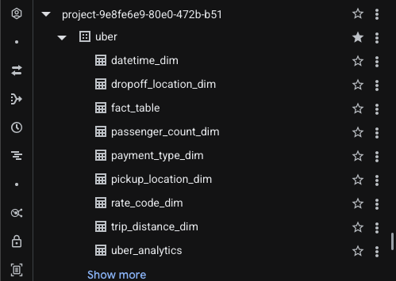

# 🚕 Uber Trip Analytics

## Project Overview
This end-to-end data engineering project analyzes 100,000+ NYC Uber trips to uncover insights on pickup hotspots, fare patterns, payment trends, and passenger behavior. Raw trip data was extracted from Google Cloud Storage, transformed into a star schema data warehouse using Mage AI, loaded into BigQuery, and visualized in an interactive Looker Studio dashboard.

## 🔗 Live Dashboard
[View Live Dashboard](https://lookerstudio.google.com/reporting/9fb56b9d-87f2-4fa7-a47e-5999c5619920)


## 📊 Key Insights
- **100K+** Uber trips analyzed
- **66.5%** of payments made by Credit Card
- **$13.25** average fare per trip
- **3.0 miles** average trip distance
- **Manhattan** is the busiest pickup location
- **$0.40** average toll charged per trip

## 🏗️ Architecture
The pipeline follows these steps:
1. Raw Uber trip data stored in **Google Cloud Storage**
2. **Mage AI** orchestrates the ETL pipeline
3. Data transformed into a **star schema** with fact and dimension tables
4. Loaded into **BigQuery** for analysis
5. Visualized in **Looker Studio**

## 📐 Data Model


## 🗄️ BigQuery Data Warehouse


🔗 [View SQL Script](bigquery/uber_analytics.sql)

## 🔄 Mage AI Pipeline


🔗 [View Mage AI Pipeline Code](mage/)

## 🛠️ Tech Stack
| Tool | Purpose | Link |
|------|---------|------|
| Python | Data transformation and pipeline logic | [Code](mage/) |
| Mage AI | ETL pipeline orchestration | [mage.ai](https://www.mage.ai) |
| Google Cloud Storage | Raw data lake | [GCS](https://cloud.google.com/storage) |
| BigQuery | Data warehouse | [BigQuery](https://cloud.google.com/bigquery) |
| Looker Studio | Data visualization | [Dashboard](https://lookerstudio.google.com/reporting/9fb56b9d-87f2-4fa7-a47e-5999c5619920) |

## 📁 Project Structure
```
Uber_Trip_Analytics/
├── README.md
├── images/
│   ├── Uber_ERD_Diagram.png
│   ├── BigQuery_Tables.png
│   ├── Mage_Pipeline.png
│   └── Uber_Trip_Analytics_Dashboard.png
├── mage/
│   ├── Extract_Uber_Data.py
│   ├── Transform_Uber_Data.py
│   └── Load_Uber_Data.py
└── bigquery/
    └── uber_analytics.sql
```

## 📦 Dataset
The dataset contains NYC Uber trip records including:
- Pickup and dropoff datetime
- Pickup and dropoff coordinates
- Passenger count
- Trip distance
- Fare amount, tip, tolls
- Payment type
- Rate code

## 🚀 How to Run
1. Clone this repository
2. Install dependencies:
```bash
pip install -r requirements.txt
```
3. Upload raw data to Google Cloud Storage
4. Start Mage AI:
```bash
mage start uber
```
5. Run the pipeline in Mage UI at `http://localhost:6789`
6. Query results in BigQuery using `bigquery/uber_analytics.sql`

## 📬 Contact
- 🔗 [LinkedIn](https://www.linkedin.com/in/ramiz-khatib/)
- 🐙 [GitHub](https://github.com/rnkanalytics-prog)
